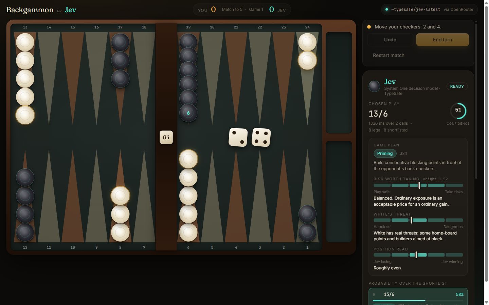

# Tavli

**[tavli.dimi.diy](https://tavli.dimi.diy)**

Tavli (τάβλι) is the Greek name for backgammon. In Greece it is played as a set of three games,
and this is the first of them, Portes, which follows standard backgammon rules with the doubling
cube in play.

The opponent is **Jev**, TypeSafe's System One decision model, reached through OpenRouter.



## The interesting part

Jev cannot write text. That is not a limitation being worked around here, it is the whole point.

A System One model takes a block of state as JSON plus typed questions, and returns typed answers
with calibrated probabilities. There is no prose to parse, no JSON-shaped prompt to validate, and
no way for it to return an illegal move. It answers in about 400 ms and costs $0.042 per million
input tokens, with output free.

That makes it a strange and rather good fit for a board game, because the thing a backgammon
engine does every single turn is exactly one Choice: given these legal plays, which is best?

Everything Jev decides is visible in the panel while you play, including the raw request and
response JSON.

## How Jev plays a turn

Code owns everything deterministic. Jev owns the judgement. That split is TypeSafe's own guidance
and it drives the whole architecture.

A turn with contact costs two calls, because questions inside a single request are evaluated
independently and in parallel, so an answer from one cannot inform another.

1. **Jev reads the position.** One call, four questions at once: which game plan fits, how much
   risk is worth taking, how dangerous the opponent is, and how Jev stands overall.
2. **Code prices every legal play.** The engine enumerates all legal plays and describes each one
   in plain facts. Risk is expressed in pips, the same unit as reward, so the two are comparable.
3. **Code shortlists eight genuinely different plays**, guaranteeing the most aggressive, the
   safest, the best structure, the best race and the most builders all appear.
4. **Jev picks the move.** A Choice question returns a probability for every option, and a
   confidence.
5. **Below 0.5 confidence, code decides instead.** Confidence-gated routing, based on measurement
   rather than taste.

Once neither side can hit the other, the position stops being a judgement and becomes arithmetic,
so the race is solved in code and Jev is not asked.

The doubling cube is a Noul question, which returns a bare probability that a statement is true.

## What the measurements showed

Every design decision above came out of running the evaluation harnesses in `scripts/`, which play
full games and grade Jev against settled backgammon opening theory.

| Change | Evidence that forced it |
|---|---|
| Risk priced in pips | Shown a bare "61% chance of being hit", Jev declined a play whose real cost was 0.6 pips. It refused all exposure in 21 of 21 chances. |
| Raw risk percentage withheld | Given both the alarming number and the accurate one, it uses the alarming one. |
| Confidence gating at 0.5 | Across 38 logged decisions, correct picks averaged 0.89 confidence and mistakes averaged 0.41. |
| Race solved in code | Jev left checkers on the board in 2 of 4 countable bear-off decisions. |
| Cube threshold 0.45 | Over 59 live cube decisions the probability tracked the position but peaked at 0.43, so the original 0.65 threshold was unreachable. |

Opening-roll benchmark against textbook play, 15 rolls, scoring 1 for best and 0.5 for acceptable:

```
baseline                          5.0 / 15
risk priced in pips               6.5 / 15
notation fix + raw risk withheld  6.0 / 15
confidence gating                 8.0 / 15
```

The single most useful finding: **rewording the instructions does not move Jev.** An ablation over
three instruction variants, including one that explicitly says exposure is often worth taking,
produced identical answers on all 15 opening rolls. What you show it matters. How you phrase the
request does not.

## Documentation

The [docs](docs/) are a tutorial. They teach System One concepts using this game as the worked
example, and are written to be useful even if you never touch backgammon.

1. [System One models](docs/01-system-one-models.md) — what Jev is, and the three primitives
2. [State and questions](docs/02-state-and-questions.md) — turning a board into a request
3. [Features are the real prompt](docs/03-features-are-the-prompt.md) — the lesson that mattered most
4. [Confidence and gating](docs/04-confidence-and-gating.md) — using calibration as a control
5. [What code should own](docs/05-code-vs-model.md) — the division of labour
6. [Measuring decision quality](docs/06-measuring-quality.md) — how to know if any of it worked

## Running it locally

```bash
yarn
yarn dev
```

Put an OpenRouter key in `openrouter.txt` at the project root, or set `OPENROUTER_API_KEY`. Both
are gitignored. Without one the game still plays: Jev's turns fall back to a deterministic
evaluation and the interface labels them as a fallback.

The browser only ever calls the relative path `/api/jev/systemone`. A server-side handler attaches
the key, so nothing secret reaches the bundle. The dev and preview servers mount that same
handler, so local behaviour matches production.

```bash
yarn test                          # engine and proxy tests, offline and fast
yarn typecheck
yarn build                         # static site
yarn build:server && yarn start    # production server on :3000
```

The live evaluation harnesses use a separate config so they never run with `yarn test`:

```bash
yarn vitest run --config vitest.live.config.ts scripts/openings.live.ts   # graded benchmark
yarn vitest run --config vitest.live.config.ts scripts/game.live.ts       # four full games
yarn vitest run --config vitest.live.config.ts scripts/ablation.live.ts   # instruction ablation
```

## Deploying

See [DEPLOY.md](DEPLOY.md). Short version: a proxy hides the key, but a spending cap on the key is
what actually bounds your bill. There is a Dockerfile for container hosts such as Coolify, and
one-file adapters for Vercel, Cloudflare Pages and Netlify.

## Layout

```
src/engine      rules, legal moves, risk pricing, race solver   (pure, tested)
src/jev         System One client, and Jev as a player
src/game        reducer state machine and the hook that runs turns
src/components  Board, Dice, Cube, Controls, JevPanel, Inspector
server          the API proxy, the production server, and their tests
scripts         live evaluation harnesses
docs            the tutorial
```

## Credits

Jev and the System One concept are by [TypeSafe](https://docs.typesafe.ai). Model access is through
[OpenRouter](https://openrouter.ai/~typesafe/jev-latest). This project is not affiliated with
either.

Built with React, Vite and Framer Motion.
